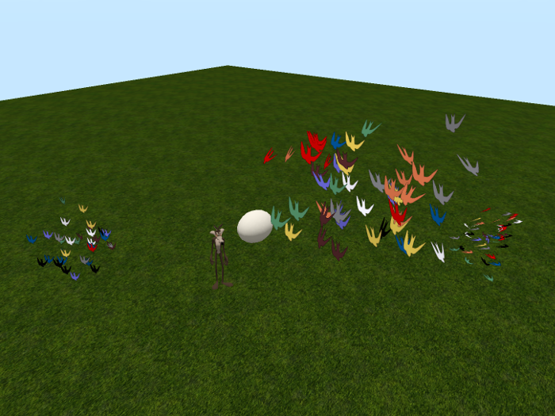
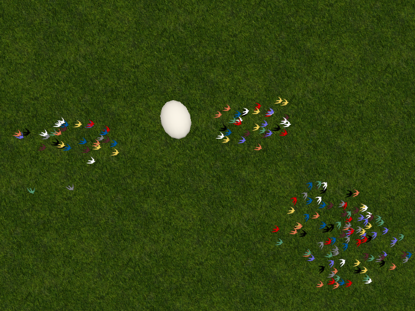

# Fourmilab Flocking Birds

[Fourmilab Flocking Birds](https://marketplace.secondlife.com/p/Fourmilab-Flocking-Birds/19907286)
is an artificial life simulation based upon the
"[Boids](https://en.wikipedia.org/wiki/Boids)" algorithm 
developed by Craig Reynolds in 1986.  The product provides an 
egg-shaped deployer which is controlled by commands in local chat.  It 
will randomly hatch (either confined to the two-dimensional X-Y plane 
or in three-dimensional space) a flock of individual birds which, 
independently fly, sense the position and motion of nearby birds, and 
obey five simple and identical rules:

1.  Turn away from the edges of the "cage" in which they are confined.
2.  Obey a limit on their maximum speed.
3.  Fly toward the centre of mass of nearby birds.
4.  Avoid collisions with nearby birds.
5.  Try to match the average velocity of nearby birds.

All of the parameters which govern these rules, such as the visual 
range within which birds can sense one another and the strengths of the 
various behaviours can be set by commands in local chat, either before 
the birds are hatched or while the simulation is running.  Each of the 
rules can be independently enabled or disable to observe how they 
affect behaviour.  Other than distributing these settings, there is no 
central control: each bird is entirely autonomous and controlled by its 
own script and what it senses within its visual range.

Despite this simplicity, a flock of these birds exhibits complex 
emergent behaviour which mimics that of real birds.  It demonstrates 
how complexity and order spontaneously emerge from simple rules without 
top-down control.  Other than the initial random assignment of bird 
position and velocity, the simulation is completely deterministic: 
there is no randomness in the behaviour of the birds, and yet the flock 
appears to be acting with free will and patterns never repeat.

This repository contains all of the software and resources,
including programs in Linden Scripting Language, textures,
notecards, and development documentation, tools, and resources
used the model and its development.  The actual model is built
within Second Life and these components are installed within it.

The
[complete model](https://marketplace.secondlife.com/p/Fourmilab-Flocking-Birds/19907286)
is available for free in the Second Life Marketplace.  This
repository contains everything in the model (except the prims,
which are objects built within Second Life), plus additional
resources for developers who may wish to extend or adapt the
model as they wish.  The model is delivered with "full permissions":
those who obtain it are free to copy, modify, and transfer it to
other users within Second Life.

All of this software is licensed under the Creative Commons
Attribution-ShareAlike license.  Please see LICENSE.md in this
repository for details.
